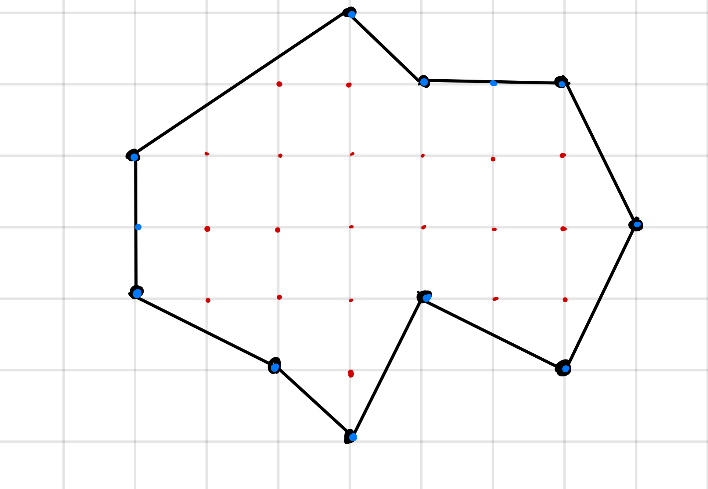
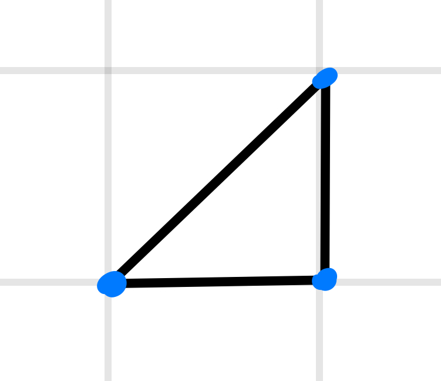

# Theorem

The area of a closed polygon with integer vertices is determined by this formula
$$\frac{B}{2} + I - 1.$$ Where $B$ is the number of vertices on the boundary
(blue in the figure) and $I$ is the number of vertices in the interior of the
shape (red in the figure).

# Proof

We will use induction on the area of the polygons.

## Base Case

The base case is simply triangles that don't have any vertices on the interior.

It is easy to see that a isoceles right triangle with side length $1$, has area
$\frac{1}{2}$. This is clear from the formula for the area of the triangle
($\frac{1}{2}bh$).

Now, if we do a operation to that triangle that preserves area, it is clear that
the area will remain the same. Now, note that all shears preserve area (from
[matrices](matrix.md.html)). A shear takes the form: 

$$\begin{bmatrix}1 & 0\\ a & 1\end{bmatrix}.$$
$$\begin{vmatrix}1 & 0\\ a & 1\end{vmatrix} = 1$$

So, shears preserve area, and thus, when a triangle is scaled by a shear, it's
area remains the same, so all triangles that are just sheared versions of each
other have area $\frac{1}{2}$. 

## Inductive Step

[^1]: I don't know how to prove these statements at the moment but they are so
  vicerally true to me that I am glossing over them (I'm sorry).

